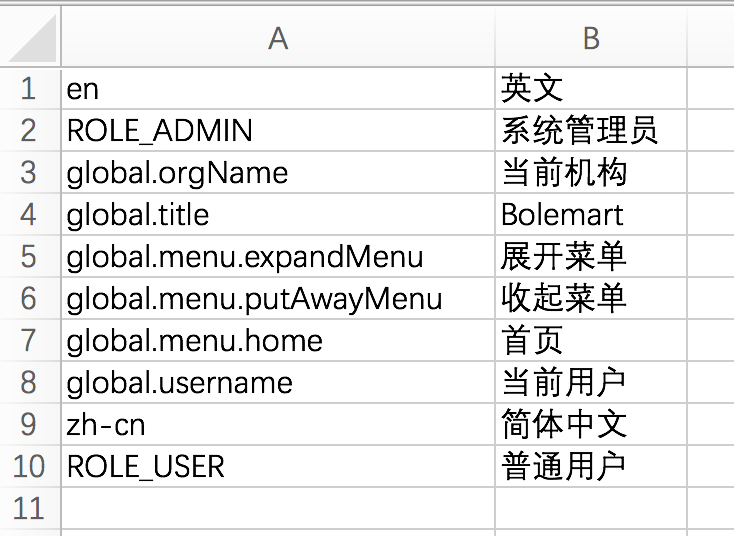

## json、excel相互转换

使用 _Springboot_ + _gradle_ + _groovy_ 开发

- 说明

    1. 多层级的json对象，转excel后，多层key将以点隔开，不保留先后顺序

    2. json文件未做校验，请上传正确的文件

- json --> excel

    - [输入](data/test.json)
    ```json
    {
        "zh-cn": "简体中文",
        "en": "英文",
        "ROLE_ADMIN": "系统管理员",
        "ROLE_USER": "普通用户",
        "global": {
            "username": "当前用户",
            "orgName": "当前机构",
            "title": "Bolemart",
            "menu": {
                "home": "首页",
                "putAwayMenu": "收起菜单",
                "expandMenu": "展开菜单"
            }
        }
    }
    ```

    - [输出](data/output.xlsx)

    

- excel --> json

    略

- 尾记

    写这个工具，主要是公司前端项目需要国际化，要把json文件转为excel给他人翻译，之前每次都是手动一条一条复制到excel，翻译后再还原回来，太过于麻烦，效率低。网上搜的各种转换工具都是单层json对象的，不符合要求，趁着有空，故写了这个工具。

    用groovy做为开发语言，是因为groovy和java类似，顺手，但是它是弱类型语言。考虑过用js写，转换逻辑差不多，然后excel的读写有现成的java工具类了，就不用js重写了，先完成一版先用着，有空再学习一下node，用node重写一个。

    编程嘛，方便生活，解决日常生活的小问题。